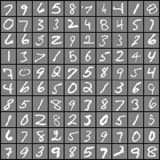

= Лабораторная работа № 3. Классиикация рукописных символов на основе методов машинного обучения

*Цель работы*: изучение алгоритмов классификации рукописных символов на основе методов машинного обучения.

== Краткая теория
Основной теоретический материал, необходимый для выполнения настоящей лабораторной работы, был рассмотрен в лекции № 5 (часть 1–4). В качестве инструмента, предлагается воспользоваться языком программирования Python, с дополнительными библиотеками NumPy, SciPy, Matplotlib.

=== 1. Подход «один против всех» на основе логистической регрессии
При выполнении задания требуется заполнить пустые места программного кода в блоках с комментарием «Ваш код здесь». Данную процедуру необходимо выполнить для следующих функций: `oneVsAll`, `predictOneVsAll`.

. При решении любой задачи с использованием инструментов машинного обучения важным является понимание структуры анализируемых данных и их визуализация в случае возможности. В настоящем задании предлагается использовать базу данных из файла `data.mat`. Данные представляют собой множество объектов, описываемых 400 признаками (нормализованные значения яркостей пикселей, описывающих рукописные цифры от 0 до 9) и меткой (от 0 до 9). Необходимо обратить внимание на то, что база данных в настоящем задании размечена, а метка принимает дискретный набор из десяти значений (0 для цифры «0», 1 для цифры «1» и т. д.). Поэтому в рамках настоящего задания рассматривается решение задачи многоклассовой классификации. За основу при формировании базы данных в задании была взята база рукописных цифр MNIST, описанная в лекции № 3. С оригинальной базой данных MNIST можно ознакомиться здесь: http://www.cs.nyu.edu/~roweis/data.html. При формировании файла `data.mat` база MNIST была усечена до 5000 объектов, разрешения изображений цифр уменьшены до 20x20 пикселей, что определяет длину вектора признаков в 400 значений, проведена нормализация признаков, поэтому при обучении использование отдельной функции нормализации не требуется. Визуализацию данных в настоящем задании можно выполнить с использованием функции `displayData`, расположенной в модуле `displayData.py`. Для выполнения визуализации данных, атакже для проверки правильности работы завершенных кодов, интерпретируйте файл `main_lr.py`. Результат визуализации представлен на рис. 1.
+

Рис. 1. Результат детектирования объекта по цветовой метке
+
. Завершите программный код в модуле `oneVsAll.py`, который позволит выполнить обучение десяти классификаторов на основе логистической регрессии для решения задачи многоклассовой классификации с использованием подхода «один против всех». Описание данного подхода для выполнения многоклассовой классификации представлено в лекции № 2. Идея реализации подхода заключается вобучении каждого из десяти классификаторов отделять один класс («положительных» примеров) от других классов («отрицательных» примеров). В данном задании, фактически, нужно обучить десять бинарных классификаторов на основе логистической регрессии так, как это делалось в практическом задании № 2. При выполнении задания совершенно необходимыми будут функции, вычисляющие значение стоимостной функции, а также выполняющие градиентный спуск для логистической регрессии. Данные функции расположены в завершенных модулях `computeCost.py` и `gradientDescent.py` впапке с заданием. Необходимо обратить внимание на то, что градиентный спуск потребуется выполнить ровно десять раз для обучения каждого из десяти классификаторов. При формировании вектора меток для положительных и отрицательных примеров может использоваться следующая команда: `(y == i).astype('uint8')`. Здесь `y` – это исходный вектор меток, содержащий числа от 0 до 9, `i` – это номер класса, который требуется отделить от всех остальных. +
Для контроля процедуры обучения при использовании функции `oneVsAll` формальный параметр `flag` можно выставить равным значению `True`. Последнее позволит выполнить визуализацию зависимости изменения значения стоимостной функции от номера итерации градиентного спуска для каждого из десяти классификаторов. При начальном тестировании завершенных программных кодов рекомендуется выставить число итераций градиентного спуска не больше 50. Последнее значительно ускорит процедуру обучения десяти классификаторов и позволит получить долю правильных ответов равную значению 88.4600 % (для 50 итераций). Итоговым продуктом процедуры обучения является матрица `all_theta` размера 401x10. Каждый столбец данной матрицы должен содержать параметры модели одного из десяти обученных классификаторов.
. Завершите программный код в модуле `predictOneVsAll.py`, который позволит выполнить предсказание метки класса при решении задачи многоклассовой классификации с использованием логистической регрессии и подхода «один против всех». Идея работы функции предсказания заключается в том, чтобы подать вектор признаков, описывающий объект, на вход каждого из десяти классификаторов и определить отклик какого из классификаторов является максимальным. При выполнении данной части задания могут понадобиться следующие функции из библиотеки `NumPy`: `dot`, `astype`, `argmax`, `transpose` и `array`.

* `dot` – позволяет вычислить матричное произведение для двумерных массивов и скалярное произведение для одномерных массивов (без комплексного сопряжения).
* `astype` – позволяет выполнить приведение элементов массива
к определенному типу данных.
* `argmax` – позволяет определить индексы максимальных значений
вдоль определенной размерности.
* `transpose` – позволяет выполнить транспонирование массива. Для одномерного массива данная функция не оказывает никакого действия, а для двумерного массива использование функции соответствует обычному матричному транспонированию.
* `array` – позволяет создать массив.

+
Так же совершенно будет необходима функция `sigmoid`, реализованная в модуле `sigmoid.py`, который находится в папке с заданием.
Выходом функции `predictOneVsAll` должен являться вектор предсказанных меток, содержащий числа от 0 до 9. Формат представления данного вектора должен полностью совпадать с форматом представления исходного вектора меток, содержащегося в аннотации к базе данных.

=== 2. Нейронная сеть прямого распространения
При выполнении задания требуется заполнить пустые места программного кода в блоках с комментарием «Ваш код здесь». Данную процедуру необходимо выполнить только для функций `predictNN`.
Настоящая часть задания не подразумевает выполнение процедуры обучения нейронной сети с использованием алгоритма обратного распространения ошибки. В место этого предлагается завершить программный код в модуле `predictNN.py`, который позволит выполнить предсказание метки класса при решении задачи многоклассовой классификации с использованием трехслойной нейронной сети прямого распространения, обученные параметры модели которой содержатся в файле `weights.mat`.

.Архитектура рассматриваемой нейронной сети является следующей:
. Число слоев: 3.
. Число нейронов во входном слое: 400 (равно числу признаков) без учета компоненты смещения.
. Число нейронов в скрытом слое: 25 без учета компоненты смещения.
. Число нейронов в выходном слое: 10 (равно числу классов).
. Функция активации нейронов скрытого и выходного слоев: сигмоидная.

При загрузке параметров модели из файла `weights.mat` с использованием `main_nn.py`, должны стать доступными две матрицы: `Theta1` (размер 25x401, веса на связях между входным и скрытым слоем) и `Theta2` (размер 10x26, веса на связях между скрытым и выходным слоем). Реализация функции `predictNN` подразумевает реализацию процедуры прямого распространения сигнала через нейронную сеть. Вначале сигнал переходит от входного слоя к скрытому, а затем от скрытого к выходному. Математические выражения, описывающие данную процедуры, представлены, в лекции № 3. При выполнении данной части задания могут понадобиться следующие функции из библиотеки `NumPy`: `dot`, `astype`, `argmax`, `transpose` и `concatenate`.

`concatenate` – выполняет объединение последовательности массивов вдоль определенной размерности.

Так же совершенно будет необходима функция `sigmoid`, реализованная в модуле `sigmoid.py`.

== Содержание лабораторной работы
. Распознавание рукописных символов на основе логистической регрессии.
. Распознавание рукописных символов на основе нейронной сети прямого распространения.

== Порядок выполнения работы
=== 1. Ознакомиться с содержимым папки с заданием, которая включает в себя файлы, представленные ниже.
* `main_lr.py` – «основной» модуль, необходимый для выполнения первой части задания, который поможет выполнить его поэтапно. Настоящий программный код не требует какой-либо коррекции!
* `main_nn.py` – «основной» модуль, необходимый для выполнения второй части задания, который поможет выполнить его поэтапно. Настоящий программный код не требует какой-либо коррекции!
* `data.mat` – база данных для выполнения первой и второй частей задания.
* `displayData.py` – модуль, содержащий функцию `displayData`, которая необходима для визуализации данных. Данный модуль не требует коррекции!
* `computeCost.py` – модуль, содержащий функцию `computeCost`, которая необходима для вычисления значения стоимостной функции логистической регрессии. Данный модуль не требует коррекции!
* `gradientDescent.py` – модуль, содержащий функцию `gradientDescent`, которая необходима для выполнения градиентного спуска с целью поиска параметров модели логистической регрессии. Данный модуль не требует коррекции!
* `oneVsAll.py` – модуль, содержащий функцию `oneVsAll`, которая необходима для обучения классификаторов на основе логистической регрессии для решения задачи многоклассовой классификации с использованием подхода «один против всех».
* `predictOneVsAll.py` – модуль, содержащий функцию `predictOneVsAll`, которая необходима для предсказания метки
класса при решении задачи многоклассовой классификации с использованием логистической регрессии и подхода «один против всех».
* `predictNN.py` – модуль, содержащий функцию `predictNN`, которая необходима для предсказания метки класса при решении задачи многоклассовой классификации с использованием трехслойной нейронной сети прямого распространения.
* `weights.mat` – файл, содержащий обученные параметры модели нейронной сети прямого распространения.
* `sigmoid.py` – модуль, содержащий функцию `sigmoid`, которая позволяет вычислить значение сигмоидной функции. Данный модуль не требует коррекции!

=== 2. Поэтапно выполнить задание, связанное с реализацией и исследованием рассматриваемых алгоритмов машинного обучения.

== Контрольные вопросы
. Что такое машинное обучение?
. Примеры задач, решаемых с использованием методов машинного обучения.
. Обучение с учителем (регрессия и классификация) и обучение без учителя (кластеризация и понижение размерности данных).
. Линейная регрессия с одной и множеством переменных.
. Алгоритм градиентного спуска.
. Логистическая регрессия.
. Бинарная и многоклассовая классификация.
. Линейная и нелинейная классификация.
. Биологические и искусственные нейронные сети.
. Искусственные нейронные сети прямого распространения. Архитектуры искусственных нейронных сетей.
. Обучение искусственных нейронных сетей (алгоритм обратного распространения ошибки).

== Литература
. Приоров А.Л., Апальков И.В., Хрящев В.В. Цифровая обработка изображений. – Ярославль: ЯрГУ, 2007.
. Гонсалес Р., Вудс Р. Цифровая обработка изображений. – М.: Техносфера, 2005.
. Нуньес-Иглесиас Х., Ван дер Уолт Ш., Харриет Д. Элегантный SciPy. – ДМК Пресс, 2018.
. Шапиро Л., Стокман Дж. Компьютерное зрение. – М.: БИНОМ. Лаборатория знаний, 2006.